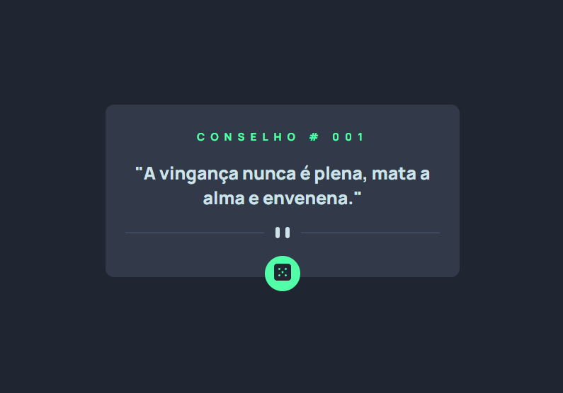
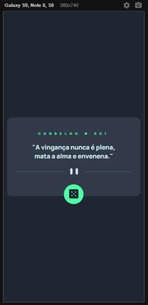

<h1 align="center">Gerador de conselhos 🥠</h1>

Desafio proposto pela equipe DevQuest [html/css] avançado

 
 <h2>🕹️ Tecnologias Utilizadas</h2>
    <ul align="center">
        
        
    </ul>

 

<h2 align="center">🤔 Como Utilizar</h2>
 
O projeto ainda não está finalizado, mas a ideia é gerar conselhos ao clicar no botão abaixo da frase. O JS será implementado futuramente.
 

<h2 align="center">📐 Página Responsiva ✂️</h2>

O projeto apresenta responsividade na navegação dos principais dispositivos: 

<ul>
    <li>Desktop 🖥️</li>
    <li>Tablet 💻</li>
    <li>Smartphone 📱</li>
</ul>

<i>Responsividade da página no Desktop.</i>

<i>Responsividade da página no Smartphone.</i>

<h2 align="center">🔗 Link da página</h2>

Logo abaixo temos o link da página para visualização e testes:

👉 <a href="https://oseiasweb.github.io/gerador-de-conselhos/" target="_blank">Gerador de conselhos</a>  

<h2 align="center">🏆 Status Projeto</h2>

 

